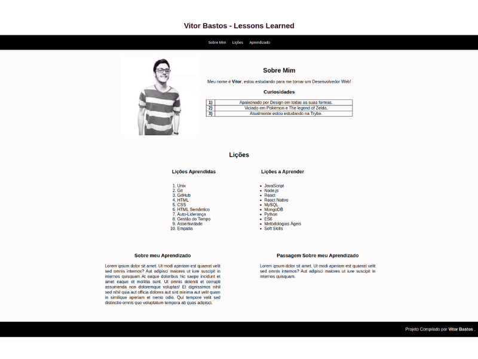

### Observações

Este é um projeto de estudo desenvolvido durante minha formação na [Trybe](https://www.betrybe.com/) :rocket:

# Projeto Lessons Learned :white_check_mark:

Criação de um site utilizando HTML e CSS, contendo uma série de informações sobre mim e os conhecimentos adquiridos ao longos dos últimos três blocos.

## Habilidades Desenvolvidas

- [X] Utilização de _HTML_ para construir páginas WEB.
- [X] Utilização de _HTML_ semântico para tornar páginas mais acessíveis e melhor ranqueadas.
- [X] Utilização de _CSS_ para adicionar estilo e posicionar elementos.

💡Veja o resultado a seguir.

