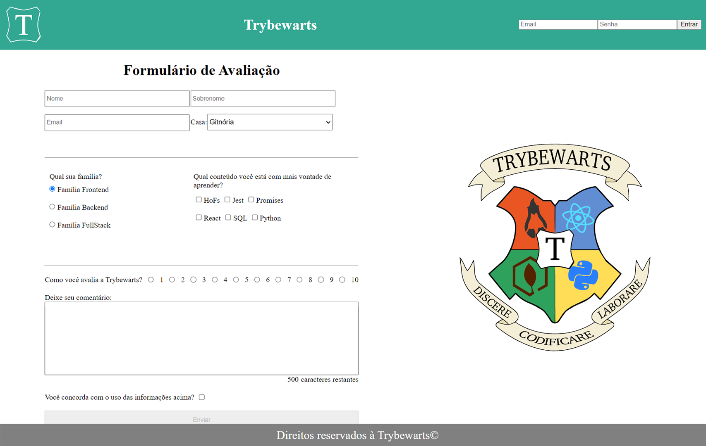

### Observações

Este é um projeto de estudo desenvolvido durante minha formação na [Trybe](https://www.betrybe.com/) :rocket:
Projeto desenvolvido em dupla com o companheiro de turma [Luciano Freitas](https://github.com/Ludoug-f) :rocket:

# Projeto TrybeWarts Form :white_check_mark:

Desenvolvimento de um Form baseado em Harry Potter utilizando HTML, CSS e JavaScript.

## Habilidades Desenvolvidas

- [X] Criação formulários em HTML.
- [X] CSS FlexBox para criar layouts flexíveis.
- [X] Criação de regras específicas em CSS.
- [X] Construção de páginas que alteram o layout de acordo com a orientação a tela.

💡Veja o resultado a seguir.

### Linter

Este projeto foi desenvolvido utilizando o linter `ESLint` seguindo as boas práticas definidas na [Trybe](https://www.betrybe.com/).
