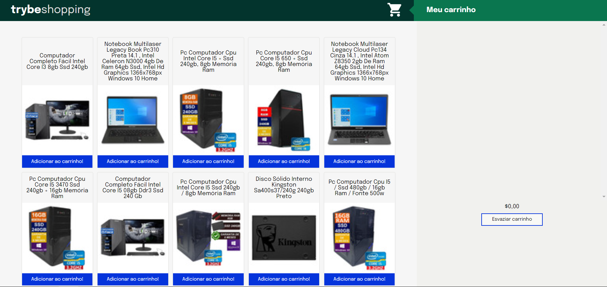

### Observações

Este é um projeto de estudo desenvolvido durante minha formação na [Trybe](https://www.betrybe.com/) :rocket:

# Projeto Shopping Cart Form :white_check_mark:

Simulação de um carrinho de compras utilizando a API do Mercado Livre. O projeto foi desenvolvido utilizando HTML, CSS, JavaScript e Jest.

## Habilidades Desenvolvidas

- [X] Requisição a uma API do Mercado Livre.
- [X] Desenvolvimento com HTML, CSS, JavaScript.
- [X] Utilização de funções assíncronas.
- [X] Testes unitários utilizando Jest.

💡Veja o resultado a seguir.

### Linter

Este projeto foi desenvolvido utilizando o linter `ESLint` seguindo as boas práticas definidas na [Trybe](https://www.betrybe.com/).

### Mocks

Os mocks para auxilio no desenvolvimento dos testes foi disponibilizado pela [Trybe](https://www.betrybe.com/).