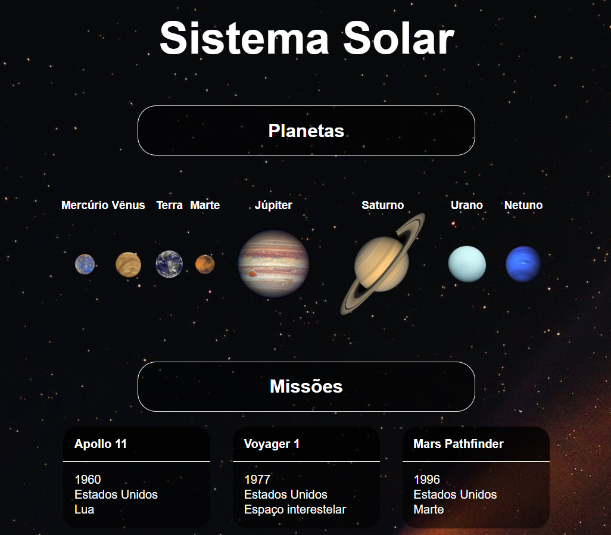

### **Observações**

Este é um projeto de estudo desenvolvido durante minha formação na [Trybe](https://www.betrybe.com/) :rocket:

# **Projeto React Solar System** :white_check_mark:

Esse projeto apresenta uma aplicação `React` completamente componetizada e estilizada com CSS. A aplicação conta a exibição de planetas do sistema solar e algumas das missões espaciais mais famosas da história.

## **Habilidades Desenvolvidas**

- [X] Utilização de JSX no React
- [X] Utilização correta do método `render()` para renderizar seus componentes
- [X] Utilização do `import` para trazer componentes em diferentes arquivos
- [X] Criação de componentes de classe em React
- [X] Criação de múltiplos componentes a partir de um array 
- [X] Uso de `props` corretamente
- [X] Uso de `PropTypes` para validação das `props` de componentes

#

💡Veja parte do resultado a seguir.



## **Instruções**

#### **Instalação**

Para utilização desta aplicação é necessária a instalação de dependências com o comando:
````
npm install
````

### **Execução**

A aplicação pode ser executada com o comando:
````
npm start
````

### **Linter**

Este projeto foi desenvolvido utilizando o linter `ESLint` seguindo as boas práticas definidas na [Trybe](https://www.betrybe.com/).

Para executar o **linter**:
````
npm run lint
````

Para executar o **stylelinter**:
````
npm run lint:styles
````

#

- Quer saber mais sobre mim? Veja o meu [LinkedIn](https://www.linkedin.com/in/vitorbss/).